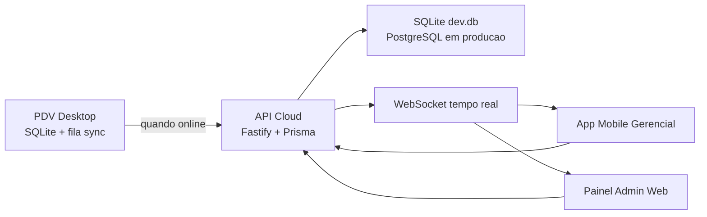

# NexPDV

NexPDV e um ecossistema PDV moderno para varejo brasileiro, com operacao offline-first no desktop e gestao remota via API Cloud, aplicativo mobile e painel administrativo web.

## Stack

- PDV Desktop: Electron, React, TypeScript, Tailwind CSS, SQLite local, Zustand, Vite.
- API Cloud: Node.js, Fastify, Prisma ORM, JWT, WebSocket. Em desenvolvimento, a API usa SQLite local em `apps/api/prisma/dev.db`; PostgreSQL segue como alvo de producao.
- Mobile Gerencial: React Native, Expo, TypeScript.
- Painel Admin: React, TypeScript, Tailwind CSS.

## Arquitetura



O PDV salva vendas, caixa, clientes e estoque no SQLite antes de qualquer tentativa de rede. A API recebe lotes da `sync_queue`, grava logs e publica eventos em tempo real para mobile/admin.

## Estrutura

```text
apps/
  desktop/  Electron + PDV offline-first
  api/      Fastify + Prisma + SQLite local de desenvolvimento
  mobile/   Expo + painel gerencial
  admin/    Painel SaaS administrativo
packages/
  shared/   Entidades, formatadores, validacoes e contratos de sync
```

## Execucao

1. Instale dependencias:

```bash
npm install
```

2. Configure ambiente:

```bash
cp .env.example .env
cp apps/api/.env.example apps/api/.env
```

3. Rode Prisma localmente com SQLite:

```bash
npm run prisma:generate -w @nexpdv/api
npm run prisma:migrate -w @nexpdv/api
npm run seed
```

O arquivo de desenvolvimento fica em `apps/api/prisma/dev.db`, usando `DATABASE_URL="file:./dev.db"` dentro de `apps/api/.env`.

4. Rode tudo em desenvolvimento:

```bash
npm run dev
```

Ou rode cada app separadamente:

```bash
npm run dev -w @nexpdv/api
npm run dev -w @nexpdv/desktop
npm run dev -w @nexpdv/admin
npm run dev -w @nexpdv/mobile
```

Login demo:

- Email: `admin@nexpdv.com.br`
- Senha: `123456`
- Licenca local: `NEXPDV-2026`

## Primeiro Acesso Do Admin SaaS

Para criar ou recuperar o super admin local do painel SaaS, rode:

```bash
npm run admin:bootstrap -w @nexpdv/api -- --email=SEU_EMAIL --password="SUA_SENHA_FORTE" --name="SEU_NOME"
```

Se nenhum parametro for informado, o comando usa:

- Email: `admin@nexpdv.com.br`
- Senha: `123456`
- Nome: `Administrador NexPDV`

O bootstrap imprime um token inicial no terminal. No painel admin, acesse `/login`, entre com email/senha inicial, informe esse token, defina a senha definitiva e configure o 2FA obrigatorio.

Para resetar o 2FA de um admin SaaS e gerar novo token inicial:

```bash
npm run admin:reset-2fa -w @nexpdv/api -- --email=SEU_EMAIL
```

Os tokens iniciais expiram, ficam armazenados com hash e sao invalidados ao concluir o primeiro acesso.

## Build

```bash
npm run typecheck
npm run lint
npm run build
npm run dist
```

O comando `npm run dist` gera o instalador Windows do PDV via `electron-builder`.

## Fluxo Offline-First

1. O caixa finaliza a venda no PDV.
2. A venda e salva no SQLite em transacao.
3. O estoque local e baixado imediatamente.
4. O movimento financeiro entra no caixa local.
5. Um registro e criado na `sync_queue`.
6. O motor de sincronizacao tenta enviar lotes para `/sync/push`.
7. Quando a API confirma, a fila local marca os itens como sincronizados.
8. A API publica eventos WebSocket para mobile e painel admin.

## Modulos Entregues

- Dashboard com faturamento, lucro, ticket medio, estoque baixo, ranking e status cloud.
- Frente de caixa com busca, carrinho, descontos, multiplos pagamentos, troco, baixa de estoque e comprovante HTML.
- Produtos com CRUD, filtros, estoque baixo e importacao CSV.
- Clientes com limite fiado e saldo.
- Caixa com abertura, entradas, saidas, sangria e fechamento.
- Historico de vendas com cancelamento e filtros.
- Relatorios com vendas, lucro, pagamentos, estoque baixo e CSV.
- Configuracoes com empresa, tema, impressao, sync, backup e licenca.
- API com auth JWT, multiempresa, vendas, estoque, dashboard, caixa, sync e WebSocket.
- Mobile com login, KPIs, ranking, vendas, produtos, alertas em tempo real e registro de push token Expo.
- Admin web com empresas, usuarios, planos, assinaturas, monitoramento e logs.

## Preparado Para Evoluir

- Integracoes fiscais futuras: NFC-e, SAT e TEF podem entrar como adapters isolados.
- Licenciamento: modelo local ja valida chave e status; API possui tabela `licenses`.
- SaaS: empresas, usuarios, planos e assinaturas ja fazem parte do schema cloud.
- Sync: conflitos simples ficam centralizados no pacote compartilhado e no endpoint `/sync/push`.

## Observacao De Ambiente

Nesta maquina, o Node global estava indisponivel durante a criacao inicial. A estrutura foi validada por arquivo com o runtime local disponivel, mas `npm install`, lint, typecheck e build final dependem das dependencias serem instaladas no ambiente.
